# 🎓 Attendance Management System (AMS) - Java Application

**Trademark:** © HarshVardhan

---

## 📝 Overview
The **Attendance Management System (AMS)** is a Java-based solution designed to simplify attendance tracking in educational institutions. It provides **role-based dashboards** for **Admins**, **Teachers**, and **Students**, ensuring secure, efficient, and accurate management of academic data.

AMS is developed using **Java SE (Standard Edition)** technologies, with **JavaFX** for GUI, **MySQL** as the database, and **Java** in the backend. It allows educational institutions to manage attendance efficiently and provides real-time access to records for students.

---

## 🌟 Key Features
- 🔒 **Secure login** with role-based access (Admin, Teacher, Student)  
- 🧑‍🎓 **Student management**: add, edit, and view student records  
- 👩‍🏫 **Teacher management**: add and edit teacher details  
- 📅 **Attendance tracking**: add, edit, and view attendance  
- 🏫 **Class management**: configure classes and schedules  
- 🖥️ **User-friendly JavaFX GUI**  

**Additional Capabilities:**
- 🔑 Login for teachers and students  
- 📝 Teachers can mark attendance for students in their classes  
- 📊 Students can view their attendance records  
- 📂 Admin can generate reports and manage users  

---

### 1️⃣ Login
**Login Dashboard** for user authentication and role-based access.  
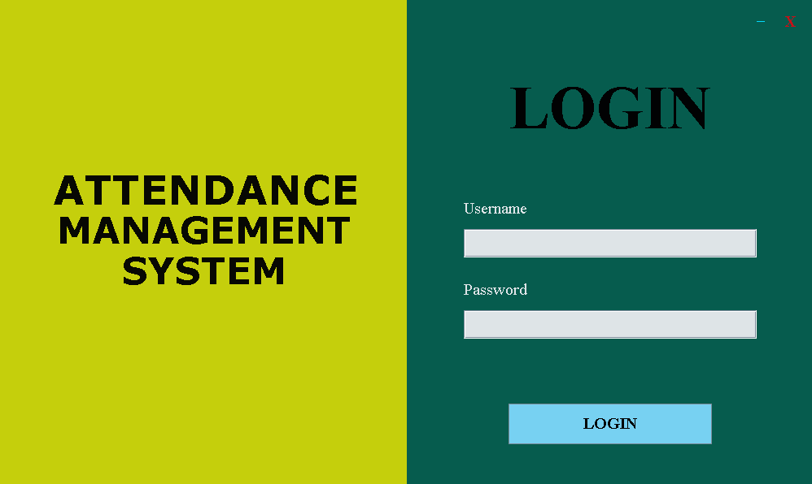

- 🔐 Authenticate users and redirect based on role

---

### 2️⃣ Admin Page
**Admin Dashboard** to manage students, teachers, classes, and attendance.  
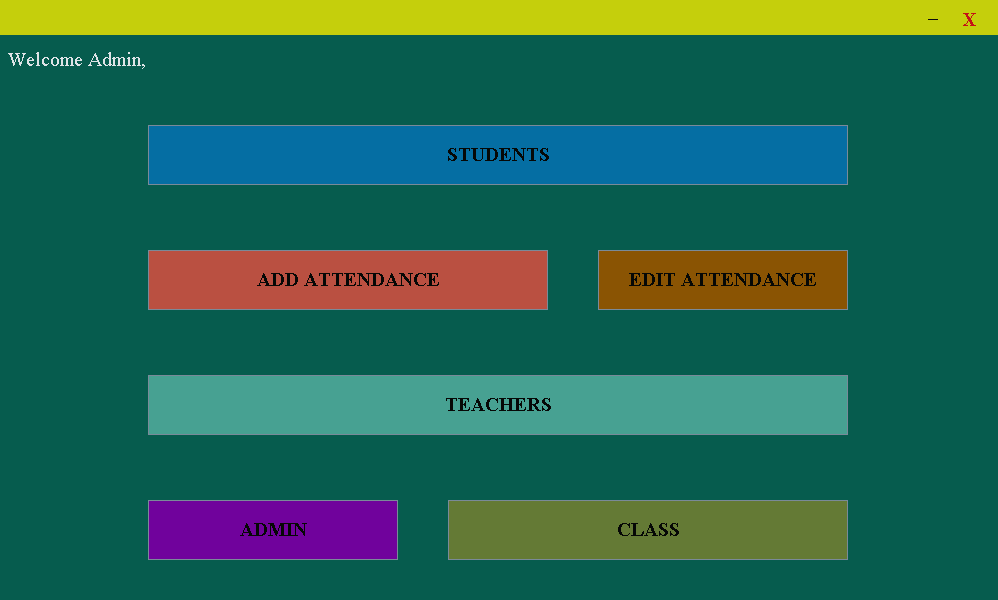

- **2.1 ADD/REMOVE STUDENT DETAILS** ✏️  
  Update student records efficiently  
  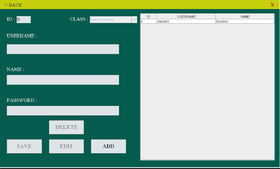  

- **2.2 ADD ATTENDANCE DETAILS** ➕  
  Insert new attendance records  
  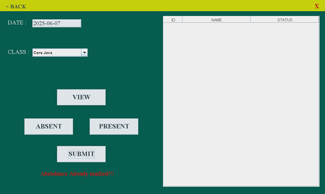  

- **2.3 EDIT ATTENDANCE DETAILS** 📝  
  Modify previously recorded attendance  
  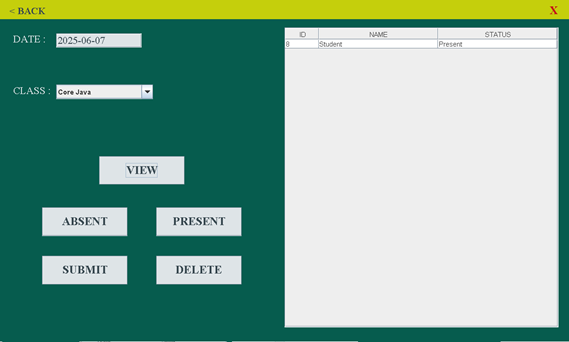  

- **2.4 ADD/REMOVE TEACHER DETAILS** 👩‍🏫  
  Manage teacher profiles  
  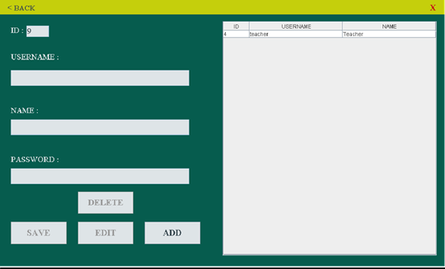  

- **2.5 ADD/REMOVE ADMIN DETAILS** 👤  
  Update administrative accounts  
  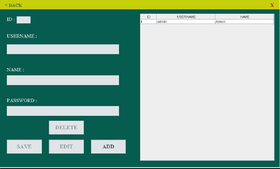  

- **2.6 ADD/REMOVE CLASS DETAILS** 🏫  
  Manage class schedules and assignments  
  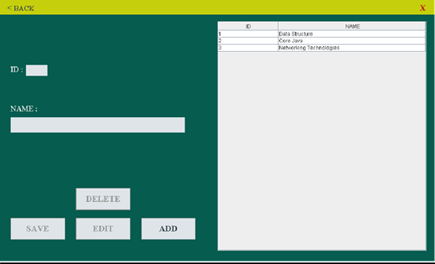  

---

### 3️⃣ Teacher Page
**Teacher Dashboard** for attendance management.  
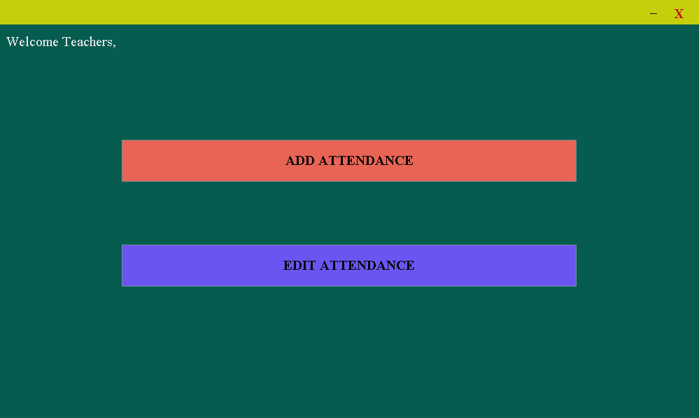

- **3.1 ADD ATTENDANCE DETAILS** ➕  
  Mark attendance for students per session  
  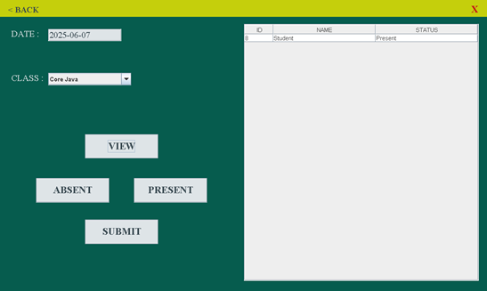  

- **3.2 EDIT ATTENDANCE DETAILS** 📝  
  Correct or update attendance records  
     

---

### 4️⃣ Student Panel
**Student Dashboard** to monitor attendance and academic information.  
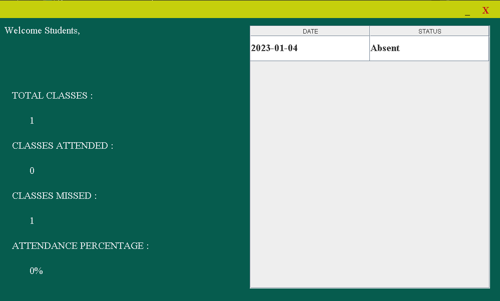

- 📊 **View Attendance**  
- 🏫 **Access Class Details**  

---

## ⚙️ Installation
1. Ensure **Java JDK 8+** is installed  
2. Extract the project zip folder  
3. Open the project in your preferred Java IDE (Eclipse, NetBeans, IntelliJ)  
4. Compile and run `Main.java`  
5. Login with your role-specific credentials to access dashboards  

---

## 🚀 Usage
1. Login as **Admin, Teacher, or Student**  
2. Navigate dashboards according to role:  
   - Admin: manage students, teachers, classes, and attendance  
   - Teacher: add or edit attendance records  
   - Student: view personal attendance records  
3. All changes reflect in real-time for accurate record-keeping  

---

## 🛠️ Implementation Steps
1. Design the user interface using **JavaFX**  
2. Connect to a **MySQL database** to store attendance records  
3. Implement the core functionality, such as marking attendance and retrieving records  
4. Integrate security features, such as password-based login  
5. Test and debug the system for accuracy and stability  

---

## 💻 Technologies Used
- **Programming Language:** Java  
- **GUI Framework:** JavaFX  
- **IDE Support:** Eclipse / NetBeans / IntelliJ IDEA  
- **Database:** MySQL  

---

## 📄 License
This project is **proprietary** and trademarked by **HarshVardhan**. Unauthorized use or distribution is prohibited.

---

**Developed By:** HarshVardhan ©
